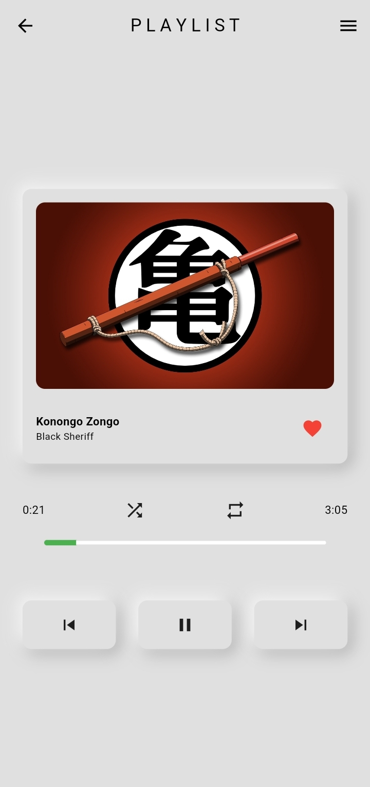
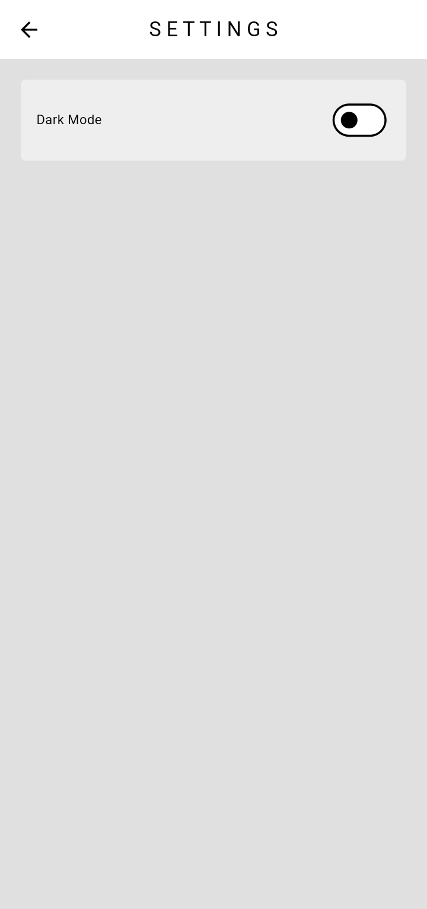
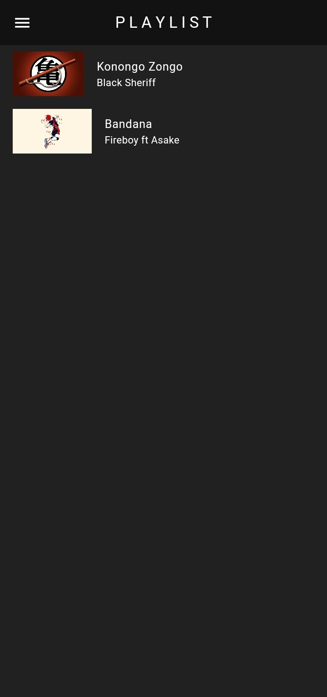
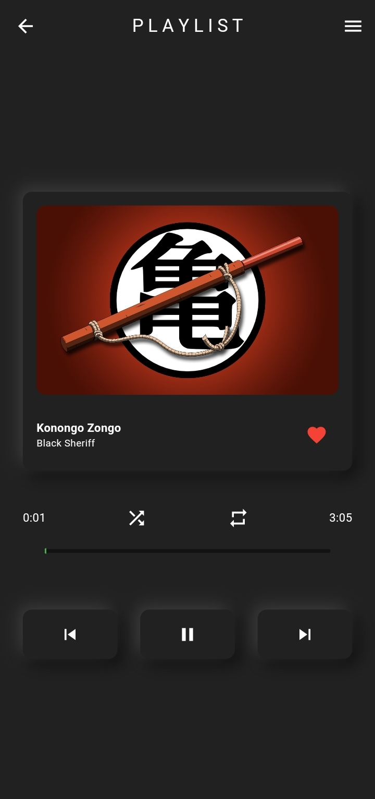
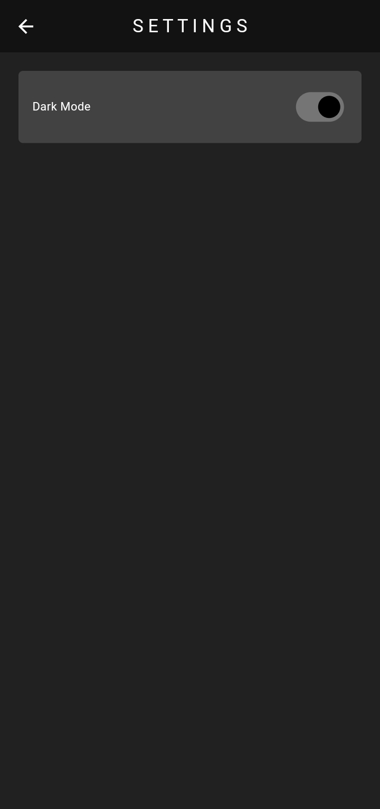

# Music Player App

Welcome to the Flutter Music Player App! This Flutter-powered application is designed to provide a seamless music listening experience.

## Overview
Flutter Music Player App allows users to play and organize their music collections with ease. It offers features such as playlist management, album artwork display, and an intuitive user interface.

## Requirements
- Flutter SDK
- Dart SDK
- Other dependencies mentioned in `pubspec.yaml`

## Features
- Create and manage playlists
- Display album artwork and song details
- User-friendly interface with smooth animations

## Links
- [GitHub Repository](https://github.com/your-username/FlutterMusicPlayerApp)
- [Demo Video](https://your-demo-video-link.com)

## Screenshots

| Home Screen | Song View | Settings |
|--------------|---------------|---------------------|
|  |  |  |

| Dark Theme 1 | Dark Theme 2 | Dark Theme 3 |
|--------------|---------------|---------------------|
|  |  |  |

## How to Use
- Play songs, create playlists, and manage your music collection effortlessly.
- Enjoy a visually appealing interface with album artwork and song details.

## Major Packages
- `audioplayers: ^x.x.x`
- `path_provider: ^x.x.x`
- Other packages as listed in `pubspec.yaml`

## Authors
- [Collins Brobbey Jnr](https://github.com/Qweku)
- [Jeffrey Boahen](https://github.com/yellow_Flickr)
